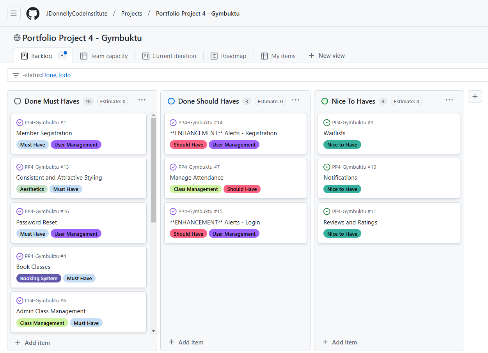

# Gymbuktu

Welcome to Gymbuktu, a modern gym that offers an array of classes as well as treadmill and freeweight use. The Gymbuktu site acts as a hub for users to create a profile, book or cancel classes, and track past and future ones. Admin users can do all this as well as update, add or delete classes in a frontend staff-only admin panel.

## Project Scope

1. Purpose

  The purpose of this project is to develop a gym booking system that enables gym members to book, manage, and cancel classes conveniently. It will also provide gym administrators with tools to manage class schedules and attendance efficiently.

2. Target Audience

    - Primary Users: Gym members seeking a user-friendly platform to book classes, view schedules, and manage their bookings.
    - Secondary Users: Gym administrators or staff responsible for overseeing class management and attendance.

3. Scope of Features

  - 3.1 Minimum Viable Product (MVP)

  The following features are essential for the system:

  - User Management:

    - Member registration and login functionality with email verification.
    - Secure user authentication leveraging Django’s built-in features.

  - Booking System:

    - Browse and search for available gym classes.
    - Book a class with available slots.
    - Cancel bookings.
    - View personal booking history.

  - Class Management:

    - Admin functionality to add, edit, and delete gym classes.
    - Admin tools to manage class bookings and attendance.

  - Schedules:

    - Calendar or list view displaying gym classes for users.

  - 3.2 Nice-to-Have Features

  These features are not critical but will enhance the system’s value if implemented:

  - Waitlists:

    - Allow users to join a waitlist if a class is full.

  - Notifications:

    - Email reminders for upcoming classes.
    - Notifications for changes or cancellations.

  - User Reviews and Ratings:

    - Enable members to rate and review classes or instructors.

  - Mobile-Friendly Enhancements:

    - Develop a Progressive Web App (PWA) for better mobile accessibility.

4. Out of Scope

  The following features will not be included in this project to prevent scope creep:

  - Real-time payment integration.
  - Detailed fitness tracking or health metrics.
  - Multi-gym or franchise-level management capabilities.

5. Technical Constraints

  Frontend: The system’s user interface will use Bootstrap to ensure a responsive and consistent design.

  Backend: The backend will be built using the Django framework for its robust features and scalability.

  Database: PostgreSQL will be used as the relational database for storing and managing data.

  Testing: Core functionalities (e.g., user management, booking, and admin tools) will undergo a mix of automated and manual testing.

  Deployment: The system will be deployed on the cloud platform Heroku for accessibility and scalability.

6. Success Metrics

  The project will be deemed successful if:

  - Gym members can register, log in, and book classes without errors.
  - Administrators can efficiently manage class schedules and bookings.
  - The system provides a responsive, mobile-friendly user experience.

## The Five Planes of User Experience

### **The Strategy Plane**
#### **Defining Goals and User Needs:**
- The goal of GymBukTu is to provide a user-friendly gym booking system that allows gym members to book, manage, and cancel classes while offering gym administrators tools to manage schedules and attendance.
- The system should provide a smooth and intuitive booking process, ensuring users can quickly find available classes and receive on-screen confirmations.
- Members need an efficient way to track their upcoming and past bookings, which is achieved through the profile page.
- Admins should have an easy-to-use interface for class management, ensuring they can update schedules and manage attendance without hassle.
- The system follows an **Agile development process**.

### **The Scope Plane**
#### **Determining Features and Content:**
- **Core Features:**
  - User authentication (sign-up, login, logout).
  - Booking system allowing members to book, manage, and cancel classes.
  - Gym administrators can add, edit, and remove classes.
  - Mobile-friendly design for non-admin users for easy access on various devices.
  
- **Additional Features (Should-Haves & Nice-To-Haves):**
  - A waitlist system for fully booked classes.
  - Class reminders and notifications to reduce no-shows.
  - A feedback system allowing users to rate classes.
  - A progressive web app (PWA) for an app-like experience.
  
### **The Structure Plane**
#### **Setting the Sitemap and Logical Flow:**
- The system follows a clear and structured navigation flow, ensuring users can access the most critical features with minimal effort.
- The primary navigation links include:
  - **Home** – Landing page including hero image, sign up link and testimonials.
  - **Classes** – List of available gym classes with booking options.
  - **Profile** – Displays current and past bookings with management options.
  - **Feedback** – Users can submit general feedback.
  - **Manage Classes** - Only available to staff, this is the frontend where staff can create, update and delete classes.

### **The Skeleton Plane**
#### **Layout and Navigation Design:**
- **Mobile-First Approach:**
  - Navigation uses a burger menu for compact mobile usability.
  - Responsive design ensures smooth user experience across devices.
  - Only exception is the manage classes section where it would be expected that staff with CRUD functionality can only access the system via an onsite computer, not on their personal devices.
- **User Flow Considerations:**
  - Bookings appear first on the profile page, with past bookings listed below.
  - Successful feedback submission redirects users to a thank-you page for confirmation.
  - Error handling and validation messages guide users if they input incorrect data.

### **The Surface Plane**
#### **Visual Design and Styling:**
- The interface follows a minimalist design, ensuring users can focus on the core functionalities without distractions.
- Bootstrap is used to provide a clean, professional look while maintaining simplicity.
- Consistent color schemes enhance the user experience:
  - Green for success messages (e.g., booking confirmation).
  - Red for errors and cancellations.
  - Blue for informational messages.
- Simple and readable typography ensures accessibility and ease of use.
- Icons are used sparingly to indicate actions (e.g., edit, delete, view details).

---
This structured approach ensures GymBukTu provides a smooth and efficient user experience while maintaining clarity and ease of use for both gym members and administrators.

## Wireframes

The wireframes are reflective of the simple theme of the site's styling, generally, bootstrap, and in particular the bootstrap card class, is used to present information clearly and efficiently, usually acting to signpost or navigate the user as required. Below we'll highlight where more was planned and implemented than the simple bootstrap card.

The first schematic was a simple one for the hypothetical layout of gymbuktu showing the reception area and the two main facilities referred to in most classes.

The **home page** changed little in the translation from wire frame bar the spacing of the testimonials on the smaller screen. It was felt that bootstrap's simple block spacing made for a sleeker look. The non-social media section of the footer is also hidden on smaller screens to avoid clutter.

The **classes page** is majoritively the same as the wireframes also, with slight formatting changes on smaller screens.

The **class_detail** page changed more significantly than most with the addition of a second card to house status information and the booking / cancellation buttons.

The **manage classes** page is close to the below with some updates to formatting and an added button for staff to manage classes manually.

The **profile page** was altered to have the quick links section appear more cleanly at the bottom of the information presented.

The **feedback page** again is basically as planned but during development functionality was added to allow users to see their submitted input beneath the form.

The gym rules page and additional / connection pages are all laid out roughly the same with a bootstrap card as the focal point. The same is true of the rest of the informational pages mainly stored in the accounts and classes apps such as password reset complete, already verified, booking confirmation, cancel booking, etc.

## ERD

ERD for database connectivity as per below. Note: The maximum capacity in the class model is limited to the capacity of the facility the class is being held in.

## Features

### The Home Page, Header, and Footer

- The home page presents users with an attractive hero image, which contains a link to sign-up to the site, as well as three testimonials from other users.
- The user starts here on their site journey and can easily and clearly see where they may go from here from the navbar and footer links.
- In the header the user will see the logo which links back to the home page if clicked.
- On the right hand side of the banner users will see 'Hello {username}' and be given the option to log out (if logged in). They will also see a nav containing options for 'Home', 'Classes', 'Feedback' and 'Profile'.

- On the right hand side of the banner users will see Log In and Sign Up links (if logged out). They will also see a nav containing options for 'Home', 'Classes', 'Feedback' and 'Profile'.

- Members of staff who are logged in will see, instead of classes in their nav, manage classes which they can navgate to to update add or delete classes. 

- On large screens the footer contains contact information for the gym, copyright and links to the gym rules users should adhere to when attending. It also contains links to the major social media sites.

- On smaller screens the nav breaks down into a burger menu, the testimonials stack neatly, and all but the social media links are hidden in the footer. The login / signup / logout functionality all moves into the burger menu, as does the link to gym rules.

### Classes

- In the classes tab users can see a full list of classes for a given date including all the relevant information.
- The user can filter classes by class name, instructor and date.
- The spaces column will update dynamically as more people book each class or if the class has gone past its start (IN PROGRESS) or end times (COMPLETED).

- The user can click into a class and see a description of the class, they can also book the class if the class has not already started or finished and is not full. If they have already booked and the class has not yet started they can cancel the booking.

- Both the classes and class detail pages are fully responsive. The class list instead of a table presents each class on its own small bootstrap card.

### Manage Classes

- Staff users can log into the manage classes page and filter classes by date.
- They can also add, edit, delete and manage the attendance of classes (marking users as having attended or not).
- The user will receive confirmation messages for each action.

- When a member of staff deletes a class any members booked to attend will receive an email notifying them of the cancellation.

### Feedback

- Users can provide general feedback and see feedback they have previously submitted.

### Profile

- Users are directed to the profile page upon login, here they can see current bookings, which they can cancel, and past bookings.

- The profile is also fully responsive

### Sign-Up

- Users can sign-up / register easily using django's inbuilt signup functionality, new users will receive an email with a verification link they'll have to follow before they can access login required functionality.
- The user will then be directed to the login page.

- The sign up page is fully responsive.

### Log In

- As with the signup functionality the login is built on django's existing capability.
- Users will only be allowed to login once their account has been verified.

### Lost / Forgotten Password Reset

- As above, this site uses django's password reset functionality to facilitate our users if their password is lost, forgotten, or compromised.
- The user receives an email with a password reset link which they can follow and reset their password.

### Automated Processes

- There are several automated processes that run without anyone noticing but are important to the site functionality:

  1. Generate Recurring Classes - classes\management\commands\generate_recurring_classes.py

    This method is written such that it will only take action on the first day of the month. It looks at all classes due to take place on the date that it runs and recreates each one 30 times but for one day later than the previous.
    This way the kind and generous folk at codeinstitute do not have to waste time creating classes themselves to test the site.
    The reason the method is written to technically run every day but only take action on the first of the month is because we're using Heroku's scheduler functionality which can only run in shorter intervals - the longest being a day - so the function is ran every day.

  2. Mark Completed Classes - classes\management\commands\mark_completed_classes.py

    Although its relatively easy to update the appearance of a class in the template with an if statement - so it says 'Hot Yoga - Complete' etc. on the Classes page, it is less easy to update the class model to mark them as complete. To combat this I set up the management command mark completed classes.
    This one runs every ten minutes and marks all classes past their end time as complete.

  3. Automatic Logouts

    Django has its own automatic logout setting in settings.py which I have used in conjunction with a small piece of javascript to smoothly log users out in real time without them having to refresh the page.
    Javascript can be found here - static\js\auto_logout.j

## Agile Approach in GymBukTu

The development of GymBukTu followed Agile principles to ensure the project was structured, manageable, and aligned with user needs.

### **Project Planning & Prioritization**
- The **Minimum Viable Product (MVP)** was prioritized first, ensuring that user authentication, class bookings, and profile management were implemented before expanding functionality.
- User stories were created and tracked in GitHub to keep development focused on what users actually needed, such as an easy way to book, cancel, and view their classes.
- Given GitHub's limitations as an Agile ticket management system, the **Project Scope** section in the README was created at the start of development. This section serves as a **high-level epic breakdown**, outlining the key principles and objectives of the project.
- From these epics, user stories were derived and prioritized based on their importance in achieving the MVP.

### **Tracking User Story Prioritization**
- User stories were categorized based on priority labels:  
  - **Must Have** – Essential for core functionality.  
  - **Should Have** – Important but not essential to launch.  
  - **Nice to Have** – Features that enhance user experience but are not required.  
- Given the relatively small size of the user stories, acceptance criteria often aligned closely with individual tasks rather than needing further task breakdowns.
- The completed functionality heavily prioritizes "Must Have" stories, with only a small percentage of "Should Have" features included and no "Nice to Haves" completed within the project timeline.

### **User Story Refinement & Implementation Evidence**
Below is a snapshot of our **GitHub Agile Board**, illustrating the breakdown of user stories and their completion status:

### **Ensuring "Should-Have" Features ≤ 60% of Total Work**
- As per Agile best practices, "Should-Have" user stories should not exceed 60% of total estimated work.
- In GymBukTu, the majority of completed features are Must Haves, while only a few Should Haves were included.
- "Nice to Have" features were deliberately left to last and therefore left out to maintain focus on MVP delivery.

### **User-Centric Development & Testing**
- The project followed a user-first approach, refining navigation, mobile responsiveness, and workflow clarity based on usability feedback.
- Automated testing was the primary method used to validate core functionalities, with manual testing supplementing areas such as UI interactions and mobile responsiveness.

## **Future Features / Nice to Haves**
In line with Agile's **MVP-first principle**, several "Nice-to-Have" user stories were not implemented in this development cycle but could be added in future iterations:

- **Waitlists** – Users can join a waitlist for full classes and be notified via email if a spot opens.
- **Notifications** – Automated email confirmations for bookings that could integrate with users' calendars and include class reminders.
- **Feedback & Reviews** – A more detailed review system for individual classes and instructors.

These features remain in the backlog and could be introduced in future development cycles based on user demand.

## Bugs  

- **Fixed:** Profile view mishandled completed booking data, preventing past bookings from moving to the past bookings section. This has now been corrected.  
- **Fixed:** Added login requirement to the `class_detail` view. Previously, users could attempt to book a class without being logged in, receive a confirmation, and then be redirected to the login page—only to find that the booking didn’t exist. Now, users must log in before proceeding to book a class, improving the user experience.  
- **Performance Issue Addressed:** The **Manage Classes** page previously attempted to load all classes at once, causing performance issues. It now filters by date and defaults to displaying only today’s classes.  
- **Enhancement:** Improved the `cancel_booking` view so that if a user cancels a class from the profile page, they are navigated back to the profile page instead of being redirected elsewhere.  
- **Fixed:** When a user attempted to book themselves into overlapping classes, the system previously threw a **500 error**. This has been resolved by handling the error properly in the `booking_confirmation` template, displaying a user-friendly message instead.  
- **Double Fix:**  
  - The **Class List** page now defaults to showing only today’s classes instead of attempting to load all classes at once, which was causing server performance issues.  
  - The **date filter** on the Class List page was not working correctly. The `class_list` view has been updated to properly format the date and apply the filter.  
  - The Class List page now dynamically displays the selected date more effectively.  
- **Fixed:** Date and time were not displaying correctly on `class_list` and `class_detail` pages. The views were updated to pull from `start_time.date` and `start_time.time`, resolving the issue.  
- **Fixed:** Users were able to book themselves into the same class multiple times. This was addressed by adding a check in the `book_class` view to prevent duplicate bookings.  

## Testing

Automated testing was implemented to verify core functionalities in GymBukTu, focusing on user authentication, bookings, and access control. Below is a summary of the tests that were written and included in the project.

### **Automated Tests**
- **User Authentication Tests**
  - Valid sign-ups are accepted, and invalid ones (missing username, email, or passwords) are rejected.
  - Ensures username uniqueness and validates email format.
  - Confirms login works with correct credentials and fails with incorrect ones.
  - Tests that inactive users cannot log in before email verification.
  - Validates that a password reset email is sent for existing accounts.

- **Booking System Tests**
  - Users can successfully book a class.
  - Users can cancel upcoming bookings but cannot cancel past bookings.
  - Past bookings are correctly displayed in the **past bookings** section.

- **Profile Page Tests**
  - Ensures bookings are displayed in the correct section (current or past).
  - The cancel button only appears for upcoming classes.

- **Email Verification Tests**
  - A verification token is created and sent upon signup.
  - Users cannot log in until they verify their email.
  - The verification link activates the account.
  - Expired or invalid tokens return an error.

- **Permissions and Access Control Tests**
  - Non-admin users cannot access class management features.
  - Users cannot modify or cancel bookings that belong to others.
  - Only authenticated users can make bookings.

Most of the testing was automated to cover critical functionality, while manual testing was conducted for UI interactions, responsiveness, and usability.

### **Manual Tests to Cover Remaining Areas**
To ensure appropriate coverage, the following manual tests have been conducted:
- Verify that users cannot book a class that is already at maximum capacity.
- Ensure users cannot book the same class twice.
- Feedback submission system works correctly.
- Ensured the UI correctly updates when bookings are made and canceled.
- Confirm that mobile responsiveness and layout consistency work as expected.
- Confirm that email notifications (booking confirmation, cancellations, etc.) are received correctly.
- Confirmed that all links across the site work as expected.

### PEP8 Compliance

PEP8 compliance for each major directory is confirmed below excluding migration and venv code, and the env import in settings.py for hosting the server in development.

### HTML Validation

HTML code passes validation as per below

[AddClass](static\images\readme\validation\addclass.png)
[ClassDetail](static\images\readme\validation\class_details.png)
[Classes](static\images\readme\validation\classes.png)
[Delete](static\images\readme\validation\delete.png)
[Edit](static\images\readme\validation\edit.png)
[Feedback](static\images\readme\validation\feedback.png)
[Home](static\images\readme\validation\home.png)
[Logout](static\images\readme\validation\logout.png)
[ManageAttendance](static\images\readme\validation\manageattendance.png)
[ManageClasses](static\images\readme\validation\manageclasses.png)
[Profile](static\images\readme\validation\profile.png)
[ResetPassword](static\images\readme\validation\reset-password.png)
[SignUp](static\images\readme\validation\signup.png)

### CSS Validation

CSS Code passes validation as per below

[CSS](static\images\readme\validation\css.png)

### JS Validation

JavaScript code passes validation as per below

[JSS](static\images\readme\validation\JSHint.png)

### Lighthouse Checks on Main Pages

[class-detail](static\images\readme\lighthouse\class-detail.png)
[class-detail-mobile](static\images\readme\lighthouse\classdetail-mobile.png)
[classes](static\images\readme\lighthouse\classes.png)
[classes-mobile](static\images\readme\lighthouse\classes-mobile.png)
[feedback](static\images\readme\lighthouse\feedback.png)
[feedback-mobile](static\images\readme\lighthouse\feedback-mobile.png)
[home](static\images\readme\lighthouse\home-desktop.png)
[home-mobile](static\images\readme\lighthouse\home-mobile.png)
[login](static\images\readme\lighthouse\login.png)
[login-mobile](static\images\readme\lighthouse\loginmobile.png)
[manage-classes](static\images\readme\lighthouse\manageclasses.png)
[manage-classes-mobile](static\images\readme\lighthouse\manageclasses-mobile.png)
[profile](static\images\readme\lighthouse\profile.png)
[profile-mobile](static\images\readme\lighthouse\profile-mobile.png)
[signup](static\images\readme\lighthouse\signup.png)
[signup-mobile](static\images\readme\lighthouse\signupmobile.png)

### Deployment Steps

## Deployment

  - Steps for deployment:
    - Fork or clone this repository
    - Create a new Heroku app
    - Set the buildbacks to Python and NodeJS in that order
    - Link the Heroku app to the repository including config var inputs
      - Configuration variables required include:
        - SECRET_KEY
        - DATABASE-URL
        - CLOUDINARY_API_KEY
        - CLOUDINARY_API_SECRET
        - CLOUDINARY_CLOUD_NAME
        - CLOUDINARY_URL
        - EMAIL_PASSWORD
        - EMAIL_USER
    - Click on Deploy
    - Once deployed, run migrations and collect static files to prepare database and assets
    - Ensure at least one dyno is runnning
    - Updates can be pushed via git as required
    - Logs can be checked via `heroku logs --tail`